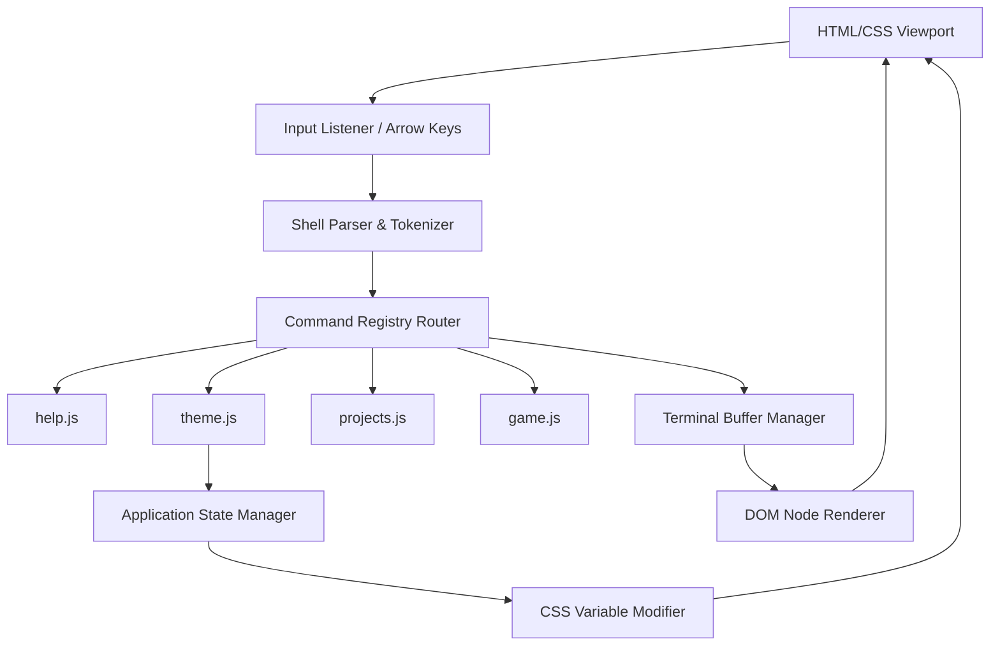

# Design Specification: Programmer-Style Command Line Interface (CLI) Portfolio

An interactive, premium terminal-themed portfolio designed for developers, systems engineers, and technical recruiters. It blends retro terminal aesthetics with modern, smooth web animations, a functional interactive shell, and a polished graphical user interface (GUI) backup for non-technical visitors.

---

## 🖥️ 1. Design Concept & Aesthetics

The portfolio utilizes a **"Cyberpunk Terminal meets Modern Glassmorphism"** aesthetic. It feels tactile, responsive, and visual, while preserving the authenticity of a command-line interface.

### Harmonious Color Schemes (Interactive Themes)
The website will support instant theme-switching via the `theme` command or a toggle button:
*   **Matrix Green (Default)**: Deep obsidian background (`#0d0d0d`), glowing matrix green text (`#00ff66`), dark gray container borders with 10% opacity, glassmorphism blur.
*   **Cyberpunk Amber**: Dark charcoal (`#120c1f`), neon amber text (`#ffb700`), hot magenta highlights (`#ff0055`).
*   **Dracula**: Deep purple-gray (`#282a36`), soft lavender text (`#f8f8f2`), vibrant pink (`#ff79c6`) and cyan (`#8be9fd`) details.
*   **Monokai**: Classic dark slate (`#272822`), warm white (`#f8f8f2`), neon green (`#a6e22e`), and amber (`#f92672`).
*   **Nordic Frost**: Cold ice-blue gray (`#2e3440`), soft frost-blue text (`#88c0d0`), and snow-white highlights (`#eceff4`).

### Typography & Layout
*   **Primary Font**: `JetBrains Mono` or `Fira Code` (loaded via Google Fonts) for perfect monospace alignment, clean ligatures, and readability.
*   **Terminal Interface**: A centered, glassmorphic window wrapper (`backdrop-filter: blur(12px)`) with glowing borders matching the active theme, a custom top bar containing standard OS window controls (red/yellow/green buttons), and a status bar indicating terminal health, latency, and current active directory.
*   **Micro-animations**:
    *   **Blinking Cursor**: Smooth CSS opacity animation for the prompt cursor (`█`).
    *   **Boot Sequence**: A rapid printout of system diagnostics upon first load.
    *   **CRT Scan Lines & Flicker**: A subtle, semi-transparent scanline overlay with an optional toggleable CRT curved flicker effect.
    *   **Terminal Scroll**: Smooth autoscrolling as commands run and output fills the screen.

---

## 🕹️ 2. Core Functional Requirements

### Interactive Command Line Shell
At the core of the portfolio is an input buffer supporting interactive execution.
*   **Command Parsing**: Tokenizes user inputs, recognizing commands, flags, and arguments (e.g., `projects --tags typescript` or `theme dracula`).
*   **Tab Completion**: Pressing `Tab` auto-completes command names or shows matching commands.
*   **Command History**: Pressing `Up Arrow` and `Down Arrow` cycles through previously executed commands.
*   **Mobile Support**: A hidden input field focused automatically when clicking the terminal, prompting the mobile keyboard to open seamlessly, paired with a floating terminal-pad for common keys (`Tab`, `Esc`, `ArrowUp`, `ArrowDown`).

### Dual-Mode UI Toggle (`gui` / `terminal`)
To accommodate non-technical visitors (e.g., HR recruiters who prefer visual layouts), the site features a dual mode:
*   **Terminal Mode**: The full command-line experience.
*   **Graphical User Interface (GUI) Mode**: A gorgeous, card-based portfolio website. The interface transitions fluidly with a screen-shatter/code-rain transition when switching modes.

---

## 🗂️ 3. Command Registry

Below is the dictionary of supported commands and their expected outputs.

| Command | Action / Response |
| :--- | :--- |
| `help` | Displays a clean table of all available commands, descriptions, and syntax. |
| `about` | Prints an interactive developer bio, including a stylized ASCII portrait or avatar. |
| `projects` | Lists personal projects. Supports flags like `--list` (compact table), `--tags <tech>` (filter), or `<name>` (details details + link). |
| `skills` | Renders a terminal-styled progress bar chart showcasing technology proficiencies. |
| `neofetch` | Displays a detailed layout: ASCII Art of the developer logo on the left, system info (OS, Browser, CPU architecture, Shell version, Active project, Uptime) on the right. |
| `contact` | Prints social links, email, and runs an interactive setup to send a message directly from the shell. |
| `theme` | Changes the console's color scheme (e.g., `theme dracula`, `theme matrix`, `theme nord`). |
| `history` | Prints a numbered list of previously executed commands in this session. |
| `clear` | Clears the terminal screen buffer. |
| `weather` | Queries a mock weather status (or a real API) for the developer's current timezone. |
| `matrix` | Fills the terminal screen with falling green binary rain (Matrix style). Pressing any key exits back to terminal. |
| `sudo <cmd>`| Displays: `[Permission Denied] This incident has been reported.` (Or triggers special easter eggs). |
| `gui` | Gracefully transitions the portfolio to the modern, glassmorphic GUI version. |

---

## 🏗️ 4. System Architecture

A vanilla-centered web architecture ensures lightning-fast performance, low loading latency, and zero dependency bloat.



### Modular Components
1.  **`index.html`**: Structure of the desktop viewport, terminal wrapper, window header, prompt wrapper, mobile support, and secondary GUI skeleton.
2.  **`styles.css`**: CSS variables for all themes, animations (`flicker`, `matrix-fall`, `blink`), styling for the interactive terminal window, CRT scanline overlay, and responsiveness rules.
3.  **`shell.js`**: Core terminal controller. Manages shell state, keyboard inputs (arrows, tab, enter), autocomplete suggestions, and command history.
4.  **`commands.js`**: Holds the command definitions. Each command is structured as an object with:
    ```javascript
    {
      name: 'theme',
      description: 'Changes the active terminal theme',
      execute: (args) => { ... }
    }
    ```
5.  **`gui.js`**: Controls the transition and structure of the graphical layout when toggled.

---

## 🧪 5. Interactive Easter Eggs & Micro-Games

To maximize user engagement, several terminal-specific easter eggs are integrated:
1.  **`sudo rm -rf /`**: Triggers a simulated kernel panic, where text corrupts/scrambles, lines slide around, followed by a simulated "rebooting..." diagnostics printout.
2.  **`play snake` / `play typing`**: Loads a retro mini-game directly inside the terminal window container using canvas or ASCII characters.
3.  **`cowsay <text>`**: Uses ASCII art of a cow to speak the provided text argument.
4.  **`starwars`**: Stream a mini ASCII art animation or quote.

---

## 🔍 6. Verification Plan

### Automated Verification
*   **Unit Tests**: Run tests on command parsing utility function to ensure various flag inputs (e.g. `--tags`, `-t`, quotes parsing for phrases) resolve correctly.
*   **Accessibility (a11y)**: Ensure colors conform to AAA contrast standards or include an accessible high-contrast theme, and terminal inputs are screen-reader accessible.

### Manual Verification
*   **Keyboard navigation**: Verify that Tab completion, Up/Down arrow history, Ctrl+C (cancels current command buffer), and Clear function correctly without lag.
*   **Mobile Compatibility**: Verify key layouts, keyboard focus behavior, and viewport responsiveness on iOS and Android browsers.
*   **GUI Mode Transition**: Ensure the transitions between Terminal and GUI modes are smooth across Chrome, Firefox, and Safari, with no text overlapping.
