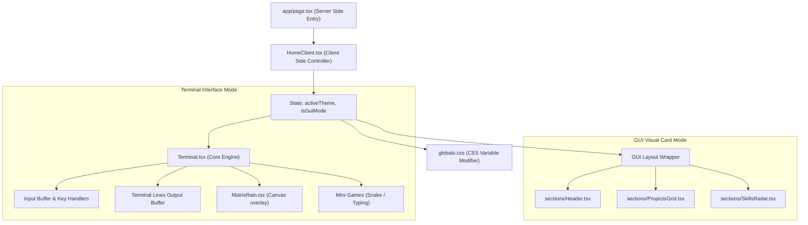

# แผนการพัฒนาและสถาปัตยกรรมระบบ (Implementation Planning)
## ระบบพอร์ตโฟลิโอสไตล์โปรแกรมเมอร์ (Programmer-Style CLI Portfolio)

---

## 1. โครงสร้างสถาปัตยกรรมคอมโพเนนต์ (Component Architecture)

แอปพลิเคชันได้รับการจัดสรรสถาปัตยกรรมแบบ Next.js Client-Side Rendering (CSR) สำหรับหน้าหลักเนื่องจากมีการทำงานเชิงตอบโต้ (Interactivity) สูง



---

## 2. การจัดการสถานะและการปรับเปลี่ยนธีมหน้าจอ (State & Theme Management)

### 2.1 CSS Variables สำหรับธีม
ระบบจะควบคุมสีสันทั้งหมดผ่าน CSS variables ที่ผูกอยู่กับคลาสของ Container หลักเพื่อความเร็วในการอัปเดตเอฟเฟกต์สี:

```css
/* ธีมเริ่มต้น Matrix Green */
.theme-matrix {
  --bg-color: #0d0d0d;
  --text-color: #00ff66;
  --accent-color: #008833;
  --border-color: rgba(0, 255, 102, 0.15);
  --shadow-color: rgba(0, 255, 102, 0.2);
  --glow-filter: drop-shadow(0 0 4px rgba(0, 255, 102, 0.5));
}

/* ธีมสุดฮิต Dracula */
.theme-dracula {
  --bg-color: #282a36;
  --text-color: #f8f8f2;
  --accent-color: #ff79c6;
  --border-color: rgba(255, 121, 198, 0.2);
  --shadow-color: rgba(255, 121, 198, 0.3);
  --glow-filter: drop-shadow(0 0 4px rgba(255, 121, 198, 0.5));
}
```

### 2.2 การตอบสนองต่อปุ่มกดและคีย์บอร์ด (Event Listeners)
- **ประวัติคำสั่ง (Command History):** ใช้แถวอาเรย์ `historyStack: string[]` และเก็บตัวแปรดัชนีชี้ตำแหน่งปัจจุบัน `historyIndex` เมื่อผู้ใช้กดลูกศรขึ้น/ลง จะดึงคำสั่งเดิมมาเขียนทับช่อง Input ปัจจุบัน
- **การกะพริบเคอร์เซอร์พรีเมียม (Blinking Cursor):** ควบคุมผ่านแอนิเมชัน CSS `@keyframes blink` ที่มีจังหวะสมูท (Ease-in-out) และความกว้างที่ขยับไปพร้อมกับการพิมพ์ตัวอักษร

---

## 3. โครงสร้างคำสั่งและระบบเราเตอร์ (Command Router Registry Pattern)

ทุกคำสั่งจะถูกพัฒนาขึ้นในลักษณะออบเจกต์ที่มีโครงสร้างเดียวกัน เพื่อความง่ายในการขยายฟังก์ชันและแยกไฟล์จัดการ:

```typescript
export interface CommandContext {
  args: string[];
  setTheme: (theme: string) => void;
  setMode: (mode: 'terminal' | 'gui') => void;
  clearBuffer: () => void;
}

export interface Command {
  name: string;
  description: string;
  execute: (context: CommandContext) => string | React.ReactNode;
}

// ตัวอย่างคำสั่งเปลี่ยนธีม
export const themeCommand: Command = {
  name: 'theme',
  description: 'เปลี่ยนสีสันหน้าจอเทอร์มินัล',
  execute: ({ args, setTheme }) => {
    const targetTheme = args[0];
    const availableThemes = ['matrix', 'dracula', 'cyberpunk', 'nord'];
    if (!targetTheme) {
      return `กรุณาระบุธีมที่ต้องการเปลี่ยน (ธีมที่มี: ${availableThemes.join(', ')})`;
    }
    if (!availableThemes.includes(targetTheme)) {
      return `ไม่พบธีม "${targetTheme}" ลองระบุธีมเป็น: ${availableThemes.join(', ')}`;
    }
    setTheme(targetTheme);
    return `เปลี่ยนธีมหน้าจอเป็น ${targetTheme} สำเร็จ`;
  }
};
```

---

## 4. การผสานระบบเกมนินิและเอฟเฟกต์ (Mini-Games & Effects Integration)

### 4.1 เกมงูกลืนกล่อง (SnakeGame.tsx)
- ถูกพัฒนาขึ้นบนองค์ประกอบ HTML5 `<canvas>` กว้างยาว 400x400 พิกเซล
- ตรวจจับปุ่มกดทิศทางของแป้นพิมพ์ (`ArrowUp`, `ArrowDown`, `ArrowLeft`, `ArrowRight`) เพื่อนำทางงู และป้องกันการป้อนคำสั่งลง Input ปกติขณะเล่นเกมอยู่
- แสดงผลคะแนนในรูปแบบตัวเลขเรืองแสง และมีปุ่มกด `Esc` เพื่อยกเลิกและปิดหน้าต่างเกมกลับสู่เทอร์มินัล

### 4.2 เกมฝึกพิมพ์ด่วน (TypingGame.tsx)
- สุ่มประโยคภาษาอังกฤษหรือประโยคชุดรหัสคำสั่งขึ้นมาให้ผู้ใช้พิมพ์ตาม
- ตรวจวัดหาความถูกต้องต่อตัวอักษร (Accuracy) และปริมาณคำที่พิมพ์ต่อนาที (Words Per Minute - WPM)
- แสดงผลลัพธ์ประวัติความเร็วการพิมพ์แบบสดๆ และสรุปค่าสถิติเมื่อผ่านแต่ละด่าน

---

## 5. แผนการตรวจสอบประสิทธิภาพและการยอมรับ (Verification Spec)

- **ประสิทธิภาพความเร็วการเปลี่ยนโหมด (Transition Frame Rate):** ตรวจทานด้วยเบราว์เซอร์ตรวจสอบประสิทธิภาพ อัตราเฟรมเรตในระยะเวลาการระเบิดสลายหน้าจอ (Code Rain/Shatter) ต้องไม่ตกลงต่ำกว่า **50 FPS**
- **ความเข้ากันได้บนหน้าจอขนาดเล็ก (Mobile Responsiveness):** ทดสอบเปิดและแตะผ่านอุปกรณ์จำลองบน iOS Safari และ Android Chrome เพื่อตรวจสอบว่าปุ่ม Virtual Pad แสดงผลได้ครบถ้วน และไม่เกิดการล้นกรอบด้านข้าง
- **การวิเคราะห์การค้นหาเว็บ (SEO validation):** ใช้เครื่องมือ Lighthouse หรือตรวจสอบโครงสร้าง Meta tags เพื่อให้มั่นใจได้ว่าคะแนนฝั่ง SEO สูงกว่า **90 คะแนน**
- **การควบคุมแป้นพิมพ์และการล้างแคช:** ทดลองรัน Tab Completion และปุ่มประวัติซ้ำๆ เพื่อให้มั่นใจว่าไม่เกิดหน่วยความจำรั่วไหล (Memory Leak) จาก Event Listener ที่ถูกสร้างค้างไว้คราวรันหลายครั้ง
