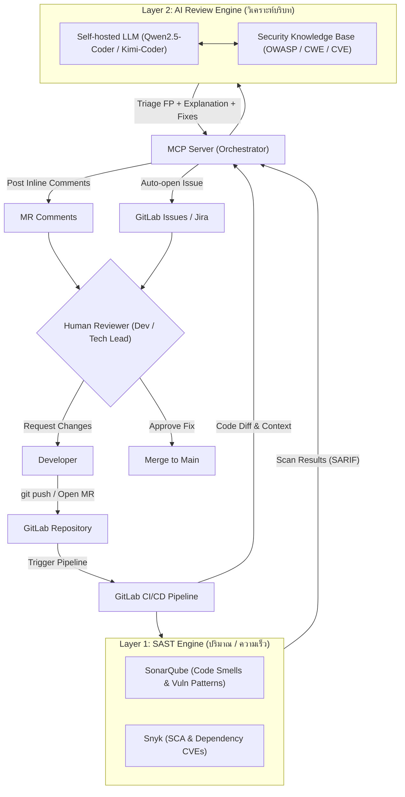
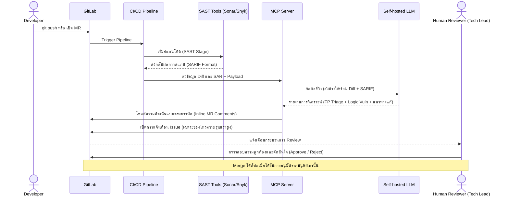
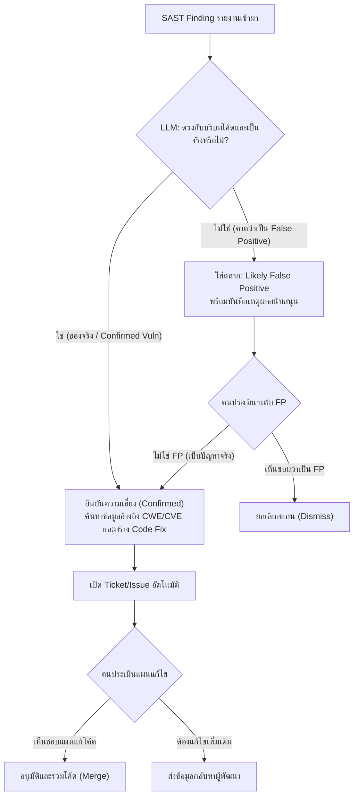

# Product Requirements Document (PRD)
## ระบบ Two-Layer Security Review (SAST & LLM Orchestration)

---

## 1. ภาพรวมของระบบ (System Overview)

### 1.1 ที่มาและความสำคัญ (Background)
การตรวจสอบความปลอดภัยของซอร์สโค้ด (Secure Code Review) ในปัจจุบันมักเผชิญปัญหาคอขวด 2 ประการหลัก:
1. **ปริมาณแจ้งเตือนที่ผิดพลาด (High False Positive Rate) จากเครื่องมือ SAST:** แม้ว่า SAST (เช่น SonarQube, Snyk) จะทำงานได้รวดเร็วและครอบคลุมโค้ดเบสทั้งหมด แต่เนื่องจากเป็นการวิเคราะห์แบบสถิตตามเงื่อนไข (Static Rules) จึงขาดการเข้าใจบริบทของโค้ด ส่งผลให้สร้างความน่ารำคาญ (Alert Fatigue) ให้กับทีมพัฒนา
2. **ข้อจำกัดในการตรวจจับ Logic Flaws:** ช่องโหว่เชิงตรรกะทางธุรกิจ (Business Logic Vulnerabilities) เช่น การสิทธิ์ผิดพลาด (Broken Access Control), การข้ามด่านยืนยันตัวตน (IDOR) หรือการรั่วไหลข้อมูลทางอ้อม มักหลุดรอดการตรวจสอบจาก SAST ไปได้ ทำให้ต้องใช้ทีม Security Analyst/Tech Lead ในการรีวิวด้วยตนเอง ซึ่งต้องใช้เวลาเฉลี่ยสูงถึง 2 ชั่วโมงต่อหนึ่ง Merge Request (MR)

### 1.2 แนวทางการแก้ไข (Proposed Solution)
ระบบ **Two-Layer Security Review** ได้รับการออกแบบขึ้นเพื่อผสานจุดเด่นของเครื่องมือวิเคราะห์ระดับอุตสาหกรรมเข้ากับพลังการวิเคราะห์บริบทของ Large Language Model (LLM) ภายใต้โครงสร้างการทำงานแบบ **Human-in-the-loop** เพื่อให้มั่นใจได้ว่ามีความถูกต้องสูงสุด ปลอดภัย และไม่หน่วงกระบวนการ Deploy โดยแบ่งเป็น 3 ด่านหลัก:
- **ด่าน 1 — SAST (SonarQube + Snyk):** คัดกรองรวดเร็วเชิงปริมาณ ค้นหารูปแบบช่องโหว่พื้นฐาน (Known Vulnerability Patterns) และ Dependency CVEs
- **ด่าน 2 — Self-hosted LLM (ผ่าน MCP Server):** รับซอร์สโค้ด Diff และผลจาก SARIF มาวิเคราะห์บริบท เพื่อคัดแยก False Positive ค้นหาช่องโหว่เชิง Logic และเสนอแนวทางการแก้ไขพร้อมข้อมูลอ้างอิง
- **ด่าน 3 — Human Approve:** นักพัฒนาหรือผู้ตรวจสอบ (Tech Lead/SA) รีวิวรายงานและอนุมัติขั้นสุดท้ายก่อนเข้าสู่กระบวนการ Merge

> [!NOTE]
> **ปรัชญาการทำงานหลัก:** SAST รับภาระ "ปริมาณ" ➡️ LLM รับภาระ "บริบท" ➡️ คนรับภาระ "ความรับผิดชอบ"

---

## 2. วัตถุประสงค์และตัวชี้วัด (Objectives & Key Results)

### 2.1 วัตถุประสงค์หลัก (Core Objectives)
- เพื่อลดระยะเวลาการทำ Code Security Review ของทีมพัฒนาลงอย่างมีนัยสำคัญ
- เพื่อยระดับความแม่นยำในการระบุช่องโหว่เชิงตรรกะ (Logic Vulnerabilities) ที่ระบบสแกนอัตโนมัติมักตรวจไม่พบ
- เพื่อให้มั่นใจในเรื่องความปลอดภัยของข้อมูลซอร์สโค้ดและทรัพย์สินทางปัญญา โดยการทำงานทั้งหมดอยู่ภายใต้ Infra ขององค์กร (VPC) เท่านั้น

### 2.2 ตัวชี้วัดประสิทธิภาพ (KPIs)
- **Review Time:** ลดระยะเวลาเฉลี่ยในการตรวจสอบความปลอดภัย MR จาก 2 ชั่วโมง เหลือต่ำกว่า **20 นาที**
- **False Positive (FP) Rate:** ลดอัตราผลลัพธ์ที่แจ้งเตือนผิดพลาดที่ส่งถึงสายตานักพัฒนาลงอย่างน้อย **70%**
- **Logic Vulnerability Detection:** ค้นพบช่องโหว่ประเภท Authorization Flaw / IDOR / Broken Access Control ได้ตั้งแต่ระยะ Development ก่อนปล่อยสู่ Production

---

## 3. หลักการออกแบบระบบ (Design Principles)

1. **Advisory, not Authoritative (เป็นผู้แนะนำ ไม่ใช่ผู้ตัดสินใจ):** LLM ทำหน้าที่สรุปและวิเคราะห์เพื่อช่วยตัดสินใจ การอนุมัติและการปฏิเสธการ Merge (Gate Control) จะขึ้นตรงกับการตัดสินใจของมนุษย์ (Human Approval) เท่านั้น
2. **Self-hosted / Internal Infra Only:** โค้ดและความลับของบริษัทห้ามถูกส่งไปยัง API ภายนอกเด็ดขาด ระบบจะทำงานบนเครื่องโมเดลที่โฮสต์เอง (เช่น Qwen2.5-Coder / Kimi-Coder ผ่าน vLLM/Ollama) ภายใน VPC ของบริษัท
3. **Reference-backed (ตรวจสอบย้อนกลับได้):** การวิเคราะห์และข้อเสนอแนะทุกชิ้นต้องมีแหล่งอ้างอิงมาตรฐานอุตสาหกรรมกำกับเสมอ (เช่น CWE, CVE, OWASP Top 10) เพื่อลดปัญหาโมเดลคิดไปเอง (Hallucination)
4. **Code = Data (โค้ดคือข้อมูลดิบ):** ป้องกันภัยคุกคามประเภท Prompt Injection โดยมองซอร์สโค้ดที่รับเข้ามาวิเคราะห์เป็นเพียง Data ไม่ใช่คำสั่งที่สั่งรันบนระบบ
5. **Incremental Scope (วิเคราะห์เฉพาะส่วนต่าง):** เพื่อความรวดเร็วและประหยัดทรัพยากร ระบบจะสแกนและรีวิวเฉพาะโค้ด Diff ของ MR นั้นๆ เท่านั้น ไม่ทำการวิเคราะห์ Repository ทั้งหมดใหม่ทุกครั้ง

---

## 4. องค์ประกอบที่สำคัญ (Key Components)

ระบบจะแบ่งออกเป็น 5 ส่วนประกอบหลัก ดังนี้:

1. **GitLab & CI/CD Pipeline:** ทำหน้าที่เป็นผู้กระตุ้นระบบ (Trigger Stage) เมื่อมีการผลักดันโค้ดใหม่ (git push) หรือสร้าง Merge Request
2. **SAST Stage (SonarQube & Snyk):** รันการวิเคราะห์โค้ดเบื้องต้น และแปลงรายงานความผิดปกติให้ออกมาเป็นโครงสร้างข้อมูลมาตรฐานในรูปแบบ **SARIF** (Static Analysis Results Interchange Format)
3. **MCP Server (Model Context Protocol):** ทำหน้าที่เป็นตัวประสานงาน (Orchestrator) แลกเปลี่ยนข้อมูลระหว่าง GitLab, ไฟล์ SARIF และโมเดลภาษาขนาดใหญ่ (LLM) โดยเตรียมฟังก์ชันเครื่องมือ (Tools) เช่น `read_diff`, `read_sarif`, `post_mr_comment`, `create_issue` ภายใต้สิทธิ์ขั้นต่ำที่จำเป็น (Least Privilege)
4. **Self-hosted LLM (vLLM / Ollama):** ส่วนประมวลผลการวิเคราะห์ระดับสูงและให้เหตุผล (Reasoning) โดยประเมินว่าปัญหาที่ SAST ค้นพบน่าจะเป็น False Positive หรือไม่ และทำการสแกนหาช่องโหว่เพิ่มเติม
5. **Knowledge Base RAG (Optional):** ชุดข้อมูลมาตรฐานความปลอดภัย (CWE, CVE, OWASP) เพื่อเป็นแหล่งอ้างอิงให้โมเดลค้นหาเพื่อยืนยันข้อผิดพลาด

---

## 5. กระบวนการทำงานแบบละเอียด (Step-by-step Workflow)

### 5.1 ขั้นตอนลำดับการทำงาน (Sequence Flow)
ความสัมพันธ์และการโต้ตอบกันระหว่างส่วนต่างๆ แสดงตามแผนภาพลำดับขั้นตอนนี้:

### 5.2 ลำดับการประมวลผลและการตัดสินใจ (Decision Logic)
กระบวนการคัดแยกผลและด่านตรวจสอบได้รับการจัดการตามโฟลว์ต่อไปนี้:

---

## 6. ข้อกำหนดการป้องกันระบบของ AI (AI Guardrails)

เพื่อลดความเสี่ยงจากการใช้งานปัญญาประดิษฐ์ ระบบจะต้องติดตั้งมาตรการป้องกันความปลอดภัย 4 ด้านหลัก:

- **ป้องกัน Prompt Injection:** ซอร์สโค้ดของผู้อื่นที่ส่งเข้ามาวิเคราะห์อาจมีคำสั่งสอดแทรก (Injection Attacks) เช่น การเขียนคอมเมนต์สั่งให้ AI ละเว้นการตรวจสอบ ระบบจะต้องมีฟิลเตอร์คัดกรอง หรือการใช้ System Prompt ที่แยกชุดคำสั่งและข้อมูลออกจากกันอย่างสิ้นเชิง
- **ป้องกันความลื่นไหลข้อมูลลวง (Anti-Hallucination):** บังคับให้การแจ้งเตือนช่องโหว่ทุกประการที่โมเดลระบุ จะต้องมีการชี้วัดแหล่งอ้างอิงที่สามารถทวนสอบได้ (เช่น ลิงก์ CWE, รหัส CVE) หากไม่มีข้อมูลสนับสนุนเพียงพอ ให้ทำเครื่องหมายเป็น `needs human verification` แทนการกล่าวอ้างลอยๆ
- **รักษาความเป็นส่วนตัวของข้อมูล (Data Privacy):** ระบบการประมวลผลต้องปิดสิทธิ์ในการเชื่อมต่อออกสู่โครงข่ายภายนอก (Internet Egress Limit) เพื่อป้องกันไม่ให้โมเดลหรือสคริปต์สุ่มส่งข้อมูลโค้ดดิบออกไปนอกบริษัท
- **จำกัดสิทธิ์การเข้าถึงข้อมูลระบบ (MCP Sandbox & Isolation):** MCP Server จะต้องจำกัดวงการรันคำสั่ง (Least Privilege Access) ไม่มีสิทธิ์ในการเข้าถึงระบบจัดเก็บไฟล์ในเครื่องอื่น และการรันเครื่องมือหรือทูลส์ต้องถูกสร้างบนสภาพแวดล้อมที่จำกัดวง (Container Isolation)

---

## 7. แผนการใช้งานจริงและเป้าหมายในอนาคต (Deployment & Beyond)

- **ระยะนำร่อง (Pilot Run):** เริ่มการเชื่อมต่อกับทีมพัฒนาขนาดเล็ก (1-2 โครงการ) เพื่อทำการปรับจูน (Finetuning/Prompt Engineering) โมเดล LLM ให้รับรู้บริบทของไลบรารีภายในของบริษัท
- **การขยายผล (Scaling):** เมื่ออัตรา FP ลดลงเหลือต่ำกว่าที่เกณฑ์กำหนด และตัวชี้วัดความพึงพอใจของนักพัฒนาเพิ่มขึ้น จะปรับใช้ระบบแบบบังคับใช้กับทุกโครงการบน GitLab ขององค์กร
- **ระบบจัดเก็บประวัติ (Triage Memory/Feedback Loop):** ในอนาคตจะเชื่อมโยงปุ่มอนุมัติของคนเก็บลงในฐานข้อมูล เพื่อใช้เป็นตัวอย่างสอนเสริม (Few-shot learning examples) ให้กับ AI ในรอบการวิเคราะห์ถัดไป ปรับลดความผิดพลาดซ้ำเดิม
